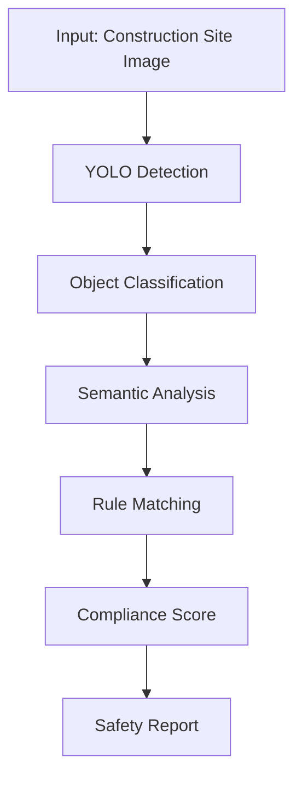

<!-- Header with Gradient -->
<div align="center">
  
# 🎯 Mohamed Aslam K

### Machine Learning Engineer | Computer Vision Specialist | IEEE Researcher

[](https://linkedin.com/in/mohamed-aslam)
[](mailto:alifnisha89295@gmail.com)
[](https://github.com/Mohamedaslam227)
[](https://ieeexplore.ieee.org/document/11005349)


</div>

```ascii
╔══════════════════════════════════════════════════════════════════════════════╗
║  "Building intelligent systems that bridge the gap between                   ║
║   research innovation and real-world impact"                                 ║
╚══════════════════════════════════════════════════════════════════════════════╝
```

---

## 💡 About

I'm a **Machine Learning Engineer** with a passion for **Computer Vision** and **Edge AI**. My work spans from research (published in IEEE) to production systems, focusing on creating practical AI solutions that solve real problems.

**Current Focus:** Building end-to-end ML pipelines, deploying models to edge devices, and exploring RAG systems for intelligent applications.

<table>
  <tr>
    <td><b>🎓 Education</b></td>
    <td>B.E. in AI & Data Science | Mepco Schlenk Engineering College | <b>CGPA: 9.13/10</b></td>
  </tr>
  <tr>
    <td><b>📍 Location</b></td>
    <td>Chennai, India</td>
  </tr>
  <tr>
    <td><b>🏆 Certification</b></td>
    <td>AWS Certified Cloud Practitioner</td>
  </tr>
  <tr>
    <td><b>📄 Publication</b></td>
    <td>IEEE WISPNET 2024 - YOLO-ASCA Framework</td>
  </tr>
</table>

---

## 🛠️ Technical Arsenal

<details open>
<summary><b>🤖 Machine Learning & AI</b></summary>
<br>


**Specializations:** YOLO (Object Detection) • Image Segmentation • Classification • Transfer Learning
</details>

<details open>
<summary><b>💻 Development & Infrastructure</b></summary>
<br>


**Capabilities:** RESTful APIs • WebSocket • Backend Development • Version Control
</details>

<details open>
<summary><b>☁️ Cloud & Databases</b></summary>
<br>


**Services:** EC2 • S3 • RDS • Data Lake • Databricks
</details>

<details open>
<summary><b>🎨 Computer Vision & Tools</b></summary>
<br>


**Formats & Tools:** COCO JSON • Darknet YOLO • Edge AI Deployment • Model Optimization
</details>

---

## 📚 Featured Research

<div align="center">

### [YOLO-ASCA: Rule-Based Framework for Construction Safety](https://ieeexplore.ieee.org/document/11005349)
**IEEE WISPNET International Conference 2024**

</div>

<table>
  <tr>
    <td width="60%">
      
**Problem Statement**  
Construction sites face critical safety compliance challenges requiring real-time monitoring and violation detection.

**Solution Approach**  
Developed a multi-modal framework combining:
- YOLOv8 for object detection
- Attentive BiGRU with GloVe embeddings for semantic analysis
- Rule-based validation engine

**Impact**  
✓ Achieved **92% accuracy** in safety compliance assessment  
✓ Real-time violation detection capability  
✓ Scalable to multiple construction environments  

    </td>
    <td width="40%">
      


    </td>
  </tr>
</table>

**Tech Stack:** `Python` `YOLOv8` `BiGRU` `GloVe` `Gradio` `PyTorch`

---

## 🚀 Notable Projects

### 🏗️ [Construction Safety Management System](https://github.com/Mohamedaslam227/Safety-Management-In-Construction-By-Semantic-Matching-Using-YOLO-ASCA)

> Real-time safety compliance monitoring using computer vision and semantic matching

- 🎯 Multi-modal AI framework combining object detection with rule-based validation
- 📊 92% accuracy in identifying safety violations
- ⚡ Real-time processing capabilities
- 🔧 Technologies: YOLOv8, BiGRU, GloVe, Python, Gradio

---

### 🎤 [Voice-Based Pronunciation Prediction](https://github.com/Mohamedaslam227/voice-based-pronunciation-prediction)

> Deep learning system for speech pattern analysis and pronunciation assessment

- 🧠 Neural network architecture for audio processing
- 🎙️ Speech recognition and pattern matching
- 📈 Predictive pronunciation modeling
- 🔧 Technologies: TensorFlow, Speech Processing, Deep Learning

---

## 💼 What I Bring to the Table

<table>
  <tr>
    <td align="center" width="25%">
      <br>
      <b>🔬 Research</b>
      <br><br>
      Published IEEE paper<br>
      Novel algorithm design<br>
      Experimental validation<br>
      <br>
    </td>
    <td align="center" width="25%">
      <br>
      <b>🏗️ Engineering</b>
      <br><br>
      End-to-end ML pipelines<br>
      Production-ready systems<br>
      Edge AI deployment<br>
      <br>
    </td>
    <td align="center" width="25%">
      <br>
      <b>👁️ Computer Vision</b>
      <br><br>
      Object detection<br>
      Image segmentation<br>
      Model optimization<br>
      <br>
    </td>
    <td align="center" width="25%">
      <br>
      <b>⚙️ Backend</b>
      <br><br>
      API development<br>
      Cloud infrastructure<br>
      System architecture<br>
      <br>
    </td>
  </tr>
</table>

---

## 🏆 Recognition & Leadership

<div align="center">

| Achievement | Details |
|------------|---------|
| 🎖️ **IEEE Publication** | Published researcher at WISPNET International Conference 2024 |
| 👥 **Institution Leadership** | Chairperson, The Institution of Engineers (India) - Department Level |
| 🥈 **Competition Success** | Runner-up in Paper Presentation & Coding Competitions |
| 🎓 **Academic Excellence** | CGPA 9.13/10 - Top performer in AI & Data Science program |
| 📢 **Event Management** | Organized and chaired Gyanmitra Technical Event |
| ☁️ **Industry Certification** | AWS Certified Cloud Practitioner |

</div>

---

## 📊 GitHub Analytics

<div align="center">


</div>

---

## 🤝 Let's Collaborate

I'm open to collaborating on:

- 🔬 **Research Projects** in Computer Vision and Deep Learning
- 🚀 **Open Source Contributions** related to ML/AI
- 💡 **Innovative Applications** of Edge AI
- 🎯 **Production ML Systems** and MLOps

### 📬 Get in Touch

<div align="center">

**Email:** alifnisha89295@gmail.com  
**Phone:** +91 7695932602  
**LinkedIn:** [linkedin.com/in/mohamed-aslam](https://linkedin.com/in/mohamed-aslam)  
**Location:** Chennai, India

---

*"Turning complex data into intelligent solutions"*

⭐ Feel free to explore my repositories and don't hesitate to reach out!

</div>
